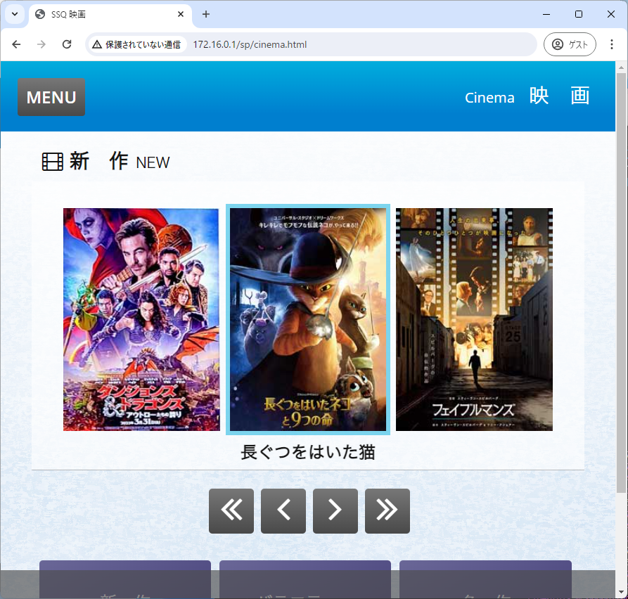

# sunflower-dl

さんふらわあのネットワークに接続した際に見ることができる、映画をダウンロードするためのツールです。

映画を見ることのできるサイトは、`m3u8` が直に埋め込まれており、Windows版のChromeでは再生することができません。
このツールを利用すると映画をダウンロードし、任意のプレイヤーで再生することができます。

ダウンロードした映画は、下船した際に削除してください。





## 使い方

pip による依存関係はありません。

```sh
$ python -V
Python 3.10.11
$ python main.py
```

## 依存関係

- ffmpeg


